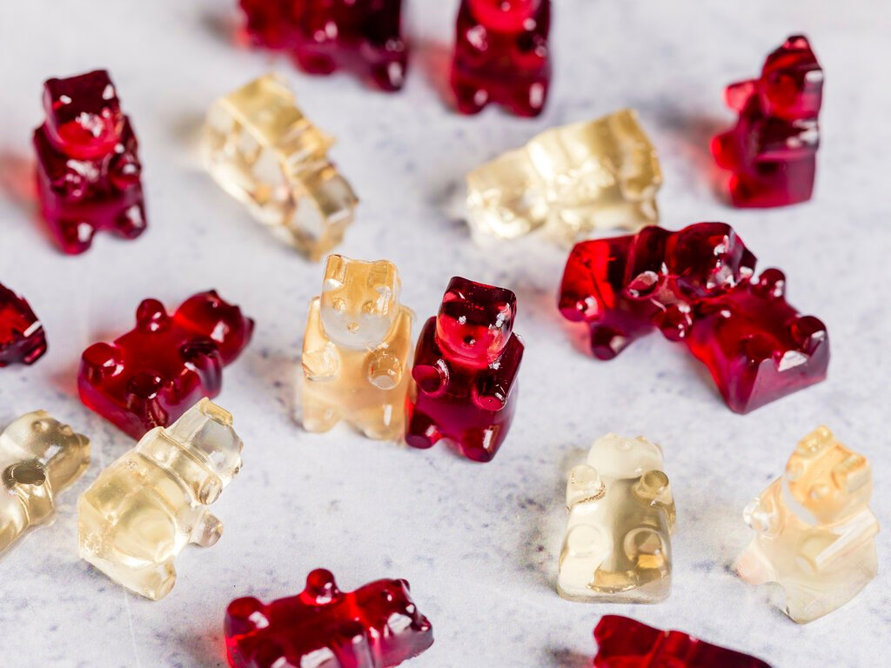

# Baumdiagramme
Wie du dich spätestens jetzt wieder erinnerst, geht es bei dem Thema "Wahrscheinlichkeit" eigentlich nur darum, richtig zu zählen. 

Entweder man führt ein Zufallsexperiment schrecklich oft durch und ermittelt die relativen Häufigkeiten, dann muss man also die Anzahl der Durchführungen des Zufallsexperimentes ordentlich mitzählen und eine saubere Strichliste für das Auftreten der einzelnen möglichen Ergebnisse führen und sie hinterher auszählen.


Oder - im Falle der Laplace-Wahrscheinlichkeit - man zählt die für das jeweilige Ereignis günstigen Ergebnisse (z.B. die Zahlen 2, 4 und 6, wenn das Ereignis "Würfeln einer geraden Zahl" lautet) und dividiert diese durch die Anzahl der möglichen Ergebnisse (beim sechsseitigen Würfel also die Ergebnisse 1, 2, 3, 4, 5 und 6). Hier gilt ja für die Wahrscheinlichkeit eines Ereignisses immer:

$P(Ereignis) = \frac{\;fuer\;das\;Ereignis\;guenstige\;Ergebnisse}{alle\;moeglichen\;Ergebnisse}$

Betrachte für ein weiteres kleines Beispiel noch einmal kurz folgendes Glücksrad:


Da alle acht Kreissektoren gleich groß sind, bleibt das Glücksrad also bei jedem der acht Sektoren mit der gleichen Wahrscheinlichkeit stehen - hier handelt es sich um ein Laplace-Experimet, bei dem es acht mögliche Ergebnisse gibt. (Nein, genau auf einer Grenze zwischen zwei Sektoren kann das Glücksrad nicht stehen bleiben. So ist das in Mathe.) Das Glücksrad kann so stehen bleiben, dass der Zeiger auf den Sektor mit der 1 zeigt oder auf den Sektor mit der 2 oder auf den Sektor mit der 3 oder auf den Sektor mit der 4 oder auf den Sektor mit der 5 oder auf den Sektor mit der 6 oder auf den Sektor mit der 7 oder auf den Sektor mit der 8. (Puh)

Möchte man nun berechnen, wie groß die Wahrscheinlichkeit ist, dass das Glücksrad so stehen bleibt, dass der Zeiger am Ende auf einen blauen Sektor zeigt, dann muss man also noch zählen, wie viele blaue Sektoren es gibt. Es gibt zwei blaue Sektoren: den mit der 1 und den mit der 5. Dann setzt man seine Zählergebnisse in die Laplace-Formel ein:

$$P(blau)=\frac{2}{8}=\frac{1}{4}=0,25$$
Das war's.

In beiden Fällen (Strichliste und Laplace-Wahrscheinlichkeit) ermittelt man die Wahrscheinlichkeit also durch Abzählen. Mehr muss man nicht tun - nur richtig zählen sollte man.

#### Wofür dann jetzt ein Baum? {-}
Beim Richtigzählen kann einem ein Baumdiagramm helfen. Es hilft einem nämlich den Überblick zu behalten. Sicher, wenn man nur abzählen soll, wie viele Ergebnisse es geben kann, wenn man mit einem sechseitigen Würfel würfelt, obiges Glücksrad dreht oder eine Münze wirft, dann braucht man kein Baumdiagramm, um den Überblick zu behalten. Zählen kann aber ganz schön schnell ganz schön schwierig werden.

Wenn sich Frau D. anziehen muss, stellt sich natürlich (auch bei ihrem spärlich ausgestatteten Kleiderschrank) die Frage, welche Hose sie mit welchem Pulli kombinieren soll.


Bei lediglich zwei Hosen und drei Pullis braucht man zugegebenermaßen auch nicht unbedingt einen helfenden Baum. Die sechs Möglichkeiten kann man vermutlich noch ohne Baumdiagramm notieren. Aber auch hier hilft der Baum, den Überblick zu behalten. Mit seiner Hilfe kann man alle Kleidungskombinationen übersichtlich darstellen. 

Jeder Pfad durch den Baum entspricht einer Kleidungskombination. Die Gesamtzahl der Möglichkeiten entspricht der Anzahl der Baumenden. Die Anzahl der unterschiedlichen Kombinationen lässt sich aber auch berechnen. Man erhält sie, indem man die Anzahlen der Möglichkeiten auf den einzelnen Stufen multipliziert. Hier gibt es 2 Hosen und 3 Pullis. Damit erhält man $2 \cdot 3 = 6$ Kleidungskombinationen.

#### Beispiel 1 {-}
Aus den Ziffern 2, 4 und 6 sollen dreistellige Zahlen gebildet werden. Erstelle ein Baumdiagramm, dem alle dreistelligen Zahlen entnommen werden können, die gebildet werden können, ..

a) ... wenn jede Ziffer nur einmal vorkommen darf.

`r hide("Lösung")`


#### {-}

b) ... wenn jede Ziffer mehrmals vorkommen darf.

`r hide("Lösung")`


#### {-}

c) Wie viele dreistellige Zahlen können in Teilaufgabe a), wie viele in Teilaufgabe b) gebildet werden?

`r hide("Lösung")`

Wenn jede Ziffer nur einmal vorkommen darf, können folgende 6 Zahlen gebildet werden: 246, 264, 426, 462, 624, 642

Wenn jede Ziffer mehrmals vorkommen darf, können 27 Zahlen gebildet werden. Du kannst sie die Pfade entlang ablesen. Die kleinste ist 222, die größte ist 666.

#### {-}

```{r, eval=knitr::opts_knit$get("rmarkdown.pandoc.to") == "html", results='asis', echo=FALSE}
cat('<hr style="background-color:#3C6690;height:2px">')
```


#### Beispiel 2 {-}
Pepe und Nele spielen "Schere, Stein, Papier".

a) Stelle die möglichen Kombinationen in einem Baumdiagramm dar.

b) Bei wie vielen Kombinationen gewinnt Pepe?

`r hide("Lösung")`

a) Auf der ersten Stufe wird Pepes Wahl notiert, auf der zweiten Stufe steht die Wahl von Nele:


b) Die Pfade, die Spielsituationen darstellen, in denen Pepe gewinnt, sind markiert:


#### {-}

```{r, eval=knitr::opts_knit$get("rmarkdown.pandoc.to") == "html", results='asis', echo=FALSE}
cat('<hr style="background-color:#3C6690;height:2px">')
```


#### Aufgabe 1 {-}
In der Mensa der Schule kann man zwischen zwei Vorspeisen (Suppe, Salat), drei Hauptgerichten (Fleisch, vegetarisch, vegan) und zwei Nachspeisen (Joghurt, Obst) wählen. 

a) Ermittle die Anzahl der möglichen Menüs.

b) Stelle die Möglichkeiten in einem Baumdiagramm dar.

`r hide("Lösung")`

a) Es gibt $2\;(Vorspeisen) \cdot 3\;(Hauptgerichte) \cdot 2\;(Nachspeisen) = 12$ Menüs.

b) 


#### {-}

```{r, eval=knitr::opts_knit$get("rmarkdown.pandoc.to") == "html", results='asis', echo=FALSE}
cat('<hr style="background-color:#3C6690;height:2px">')
```


#### Aufgabe 2 {-}
Ein Passwort besteht aus den Buchstaben H, U und T. Jeder Buchstabe kommt genau einmal vor. Ermittle die Anzahl der möglichen Passwörter...

a) ... rechnerisch.

b) ... mit einem Baumdiagramm.


`r hide("Lösung")`

a) Man kann $3 \cdot 2 \cdot 1 = 6$ verschiedene Passwörter erstellen.

b) 


#### {-}

```{r, eval=knitr::opts_knit$get("rmarkdown.pandoc.to") == "html", results='asis', echo=FALSE}
cat('<hr style="background-color:#3C6690;height:2px">')
```


#### Aufgabe 3 {-}
Emily verbringt ein paar Tage in Passau. Sie möchte den Passauer Dom und die Feste Oberhaus besichtigen sowie auf einem der berühmten Schiffe ein bisschen auf Donau und Inn herumschippern. Ermittle die Anzahl der Möglichkeiten für die Reihenfolge der Besichtigungen.

`r hide("Lösung")`

Emily hat $3 \cdot 2 \cdot 1 =6$ Möglichkeiten, ihre Tour zu gestalten:


#### {-}


```{r, eval=knitr::opts_knit$get("rmarkdown.pandoc.to") == "html", results='asis', echo=FALSE}
cat('<hr style="background-color:#3C6690;height:2px">')
```


#### Aufgabe 4 {-}
In Peters Zimmer hängen vier Bilder. Er überlegt, die Bilder umzuhängen.

a) Ermittle die Anzahl der Möglichkeiten, die vier Bilder auf die vier Plätze zu verteilen.

`r hide("Lösung")`

Peter hat $4 \cdot 3 \cdot 2 \cdot 1= 24$ Möglichkeiten, die vier Bilder auf die vier Plätze zu verteilen:


#### {-}

b) Peter sortiert ein Bild aus und hängt die anderen drei Bilder wieder auf. Ermittle, wie sich die Anzahl der Möglichkeiten ändert. Erläutere deine Lösung.

`r hide("Lösung")`

Da Peter immer noch 4 Pätze zur Verfügung hat, hat er immer noch 24 Möglichkeiten, die nun mehr bloß drei Bilder auf die vier Plätze zu verteilen. Dabei verteilt er auch immer einen leeren Platz (also NIX).


Hätte Peter nicht nur ein Bild aussortiert, sonder zusätzlich noch beschlossen, dass beispielsweise an der Wand neben der Türe nichts mehr hängen soll, hätte er nur noch $3 \cdot 2 \cdot 1 = 6$ Möglichkeiten, die verbleibenden Bilder zu verteilen.

#### {-}


## Mehrstufige Zufallsexperimente
Mehrstufige Zufallsexperimente sind Zufallsexperimente, die aus mehreren nacheinander ausgeführten Versuchen bestehen. Ihre Ergebnisse sind zusammengesetzte Ergebnisse.

Beispiele sind:

+ das zweimalige (dreimalige, viermalige, ...) Würfeln mit einem Würfel. Beim zweimaligen Würfeln könnte das zusammengesetzte Ergebnis z.B. lauten "erst 3, dann 5".

+ genauso kann natürlich auch das gleichzeitige Würfeln mit zwei (drei, vier, ...) unterscheidbaren Würfeln interpretiert werden. Beim gleichzeitigen Würfeln mit einem blauen und einem roten Würfel etwa kann das zusammengesetzte Ergebnis lauten "blau 3, rot 5".

+ das zweimalige (dreimalige, viermalige,...) Werfen einer Münze. Beim zweimaligen Werfen einer Münze könnte das zusammengesetzte Ergebnis z.B. lauten " erst Zahl, dann Kopf". Analog zum Würfel kann auch hier das gleichzeitige Werfen unterscheidbarer Münzen genauso interpretiert werden.

+ mehrere Lose nacheinander aus einer Lostrommel ziehen.

Besonders übersichtlich lassen sich mehrstufige Zufallsexperimente in einem Baumdiagramm darstellen. So kann man beispielsweise das zweifache Werfen einer Münze durch das folgende Baumdiagramm darstellen:


Dabei ist es egal, ob man eine Münze zweimal wirft oder aber zwei Münzen gleichzeitig wirft. Im ersten Fall entspricht die erste Stufe dem ersten Münzwurf und die zweite Stufe dem zweiten Münzwurf. Im zweiten Fall entspricht die erste Stufe eben dem Wurf der einen und die zweite Stufe dem Wurf der anderen Münze. 

In beiden Fällen hilft der Baum eine übersichtliche Darstellung der möglichen Ergebnisse zu erhalten. Diese kann man nun alle an den Pfadenden ablesen: $\Omega=\{KK,\; KZ,\; ZK,\; ZZ\}$, wobei K für Kopf (hier eigentlich eher Adler) und Z für Zahl steht. Gleichzeitig weiß man also auch, wie viele Ergebnisse möglich sind: 4.

## Wahrscheinlichkeiten und Baumdiagramme
Wie du wahrscheinlich schon bemerkt hast, können an den Zweigen des Baumes auch Zahlen notiert werden.


Dabei handelt es sich um die Wahrscheinlichkeit, mit der das jeweilige Teilergebnis zu erwarten ist. Die Wahrscheinlichkeit muss also schon bekannt sein. Ob du sie mit Hilfe des empirischen Gesetzes der großen Zahlen (also durch viele Wiederholungen eines Zufallsexperiments) herausgefunden hast oder sie Ergebnis einer theoretischen Überlegung ist (Laplace-Experiment), ist natürlich egal.

Im Beispiel des Münzwurfs sind die Teilergebnisse "Kopf" oder "Zahl" mit einer Wahrscheinlichkeit von $\frac{1}{2}$ möglich. Dies gilt sowol für den ersten, als auch für den zweiten Münzwurf. 

### Produktregel
Wie ermittelt man nun die Wahrscheinlichkeit der zusammengesetzten Ergebnisse?

Betrachte noch einmal das Baumdiagramm für den zweifachen Münzwurf:


Zu jedem der vier zusammengesetzten Ergebnisse ($\{KK,\; KZ,\; ZK,\; ZZ\}$), gehört ein Pfad - die Stufen des Pfades sind dabei die einzelnen Teilergebnisse. 

Wie hoch ist also die Wahrscheinlichkeit dafür, zweimal "Kopf" zu werfen? Der Pfad, der zu dem Ergebnis zweimal Kopf gehört, ist blau gefärbt. Bei jedem der beiden Würfe ist das Teilergebnis "Kopf" mit einer Wahrscheinlichkeit von $\frac{1}{2}$ möglich. Die Wahrscheinlichkeit für das Ergebnis "Kopf-Kopf" (KK) ist also $\frac{1}{2}$ von $\frac{1}{2}$ und damit $\frac{1}{2}\cdot\frac{1}{2}=\frac{1}{4}$.


Kurz und knapp fasst diese Überlegung die **Produktregel** oder auch **Pfadmultiplikationsregel** zusammen:

#### Produktregel: {-}

> Die **Wahrscheinlichkeit für ein zusammengesetztes Ergebnis** erhält man, indem man die einzelnen Wahrscheinlichkeiten entlang des zugehörigen Pfades multipliziert.

Natürlich gilt auch für mehrstufige Zufallsexperimente, dass sich die Wahrscheinlichkeiten aller zusammengesetzten Ergebnisse zu 1 (zu 100%) addieren.

#### Beispiel {-}


Das Glücksrad wird zweimal gedreht. Ermittle die Wahrscheinlichkeit, dass es zweimal bei Rot stehen bleibt. Erstelle dazu ein Baumdiagramm.

`r hide("Lösung")`


Der Pfad ganz links stellt das Ergebnis "Rot-Rot" dar. Die Wahrscheinlichkeit für die Farbe Rot beträgt in jeder Drehung $\frac{2}{3}$.

Nun multipliziert man die Einzelwahrscheinlichkeiten entlang des Pfades ganz links (das ist ja der Pfad, der zu "Rot-Rot" führt, erhält man die Wahrscheinlichkeit für "Rot-Rot" (RR).

$P(RR)=\frac{2}{3}\cdot\frac{2}{3}=\frac{4}{9}$

#### {-}


```{r, eval=knitr::opts_knit$get("rmarkdown.pandoc.to") == "html", results='asis', echo=FALSE}
cat('<hr style="background-color:#3C6690;height:2px">')
```

#### Aufgabe 1 {-}


Das Glücksrad wird zweimal gedreht.

a) Zeichne das zugehörige Baumdiagramm und notiere die Wahrscheinlichkeiten an den Zweigen.

`r hide("Lösung")`


#### {-}

b) Welche zusammengesetzten Ergebnisse sind möglich? Bestimme zudem jeweils die Wahrscheinlichkeit.

`r hide("Lösung")`

Folgende zusammengesetzte Ergebnisse sind möglich: $\{Blau\;Blau,\; Blau\;Rot,\; Rot\;Blau,\; Rot\;Rot\}$

Zu diesen gehören jeweils die folgenden Wahrscheinlichkeiten:

$P(Blau\;Blau)= \frac{4}{5}\cdot\frac{4}{5}=\frac{16}{25}= 0,64$

$P(Blau\;Rot)= \frac{4}{5}\cdot\frac{1}{5}=\frac{4}{25}=0,16$

$P(Rot\;Blau)= \frac{1}{5}\cdot\frac{4}{5}=\frac{4}{25}=0,16$

$P(Rot\;Rot)= \frac{1}{5}\cdot\frac{1}{5}=\frac{1}{25}= 0,04$

#### {-}


c) Kontrolliere deine Überlegungen: Ergibt die Summe der Wahrscheinlichkeiten der zusammengesetzten Ergebnisse 1 (100%)?

`r hide("Lösung")`

Ja, die Summe der Wahrscheinlichkeiten der zusammengesetzten Ergebnisse ergibt 1:

$$\begin{align} &P(Blau\;Blau) + P(Blau\;Rot) + P(Rot\;Blau)+ P(Rot\;Rot) = \\
=\; &0,64 + 0,16 + 0,16 + 0,04 = 1\end{align}$$

#### {-}


```{r, eval=knitr::opts_knit$get("rmarkdown.pandoc.to") == "html", results='asis', echo=FALSE}
cat('<hr style="background-color:#3C6690;height:2px">')
```

#### Aufgabe 2 {-}


Jim spielt mit Lukas Karten. Lukas hat acht Karten auf der Hand: je zwei Karten von jeder Farbe (also zweimal Herz, zweimal Pik, zweimal Karo und zweimal Kreuz). Jim darf nun sein Glück versuchen, er gewinnt, wenn er zweimal hintereinander Karo zieht. 

Er zieht blind eine Karte, notiert das Ergebnis und gibt die Karte zurück. Lukas mischt seine Karten und Jim hat noch einen Versuch, blind eine Karte zu ziehen.

a) Erkläre, was das Ergebnis "Herz - Karo" bedeutet.

`r hide("Lösung")`

Das Ergebnis "Herz-Karo" bedeutet, dass Jim im ersten Versuch eine Herz- und im zweiten Versuch eine Karo-Karte zieht.

#### {-}

b) Zeichne ein Baumdiagramm und trage die Wahrscheinlichkeiten ein. Markiere den/die Pfad(e), die zu Gewinnen führen.

`r hide("Lösung")`


#### {-}

c) Nenne alle möglichen Ergebnisse und berechne ihre Wahrscheinlichkeiten.

`r hide("Lösung")`

Folgende 16 Ergebnisse sind möglich:

$\{HH,\; HP,\; HKa,\;HKr,\;PH,\;PP,\;PKa,\;PKr,\;KaH,\;KaP,\;\;KaKa,\;KaKr,\;KrH,\;KrP,\;KrKa,\;KrKr\}$

Alle 16 Ergebnisse haben dieselbe Wahrscheinlichkeit, nämlich $\frac{1}{4}\cdot\frac{1}{4}=\frac{1}{16}=0,0625$.

#### {-}


```{r, eval=knitr::opts_knit$get("rmarkdown.pandoc.to") == "html", results='asis', echo=FALSE}
cat('<hr style="background-color:#3C6690;height:2px">')
```

#### Aufgabe 3 {-}
Charlotte spielt Basketball. Sie trifft den Korb beim Basketballfreiwurf mit einer Wahrscheinlichkeit von 0,6 und darf dreimal werfen.


a) Zeichne ein Baumdiagramm mit Wahrscheinlichkeiten.

`r hide("Lösung")`


#### {-}

b) Berechne die Wahrscheinlichkeit, dass Charlotte dreimal trifft.

`r hide("Lösung")`

Der zu diesem Ergebnis gehörende Pfad ist grün markiert. Multipliziert man die Wahrscheinlichkeiten entlang des Pfades, ergibt sich:

$P(Korb\;Korb\;Korb)=0,6\cdot0,6\cdot0,6=0,216$

Charlotte trifft also mit einer Wahrscheinlichkeit von 21,6% dreimal.

#### {-}

c) Berechne die Wahrscheinlichkeit für das Ergebnis "Korb - kein Korb - Korb".

`r hide("Lösung")`

Der zu diesem Ergebnis gehörende Pfad ist orange markiert. Multipliziert man die Wahrscheinlichkeiten entlang des Pfades, ergibt sich:

$P(Korb\;kein\;Korb\;Korb)=0,6\cdot0,4\cdot0,6=0,144$

Die Abfolge "Korb, kein Korb, Korb" hat also eine Wahrscheinlichkeit von 14,4%.

#### {-}


```{r, eval=knitr::opts_knit$get("rmarkdown.pandoc.to") == "html", results='asis', echo=FALSE}
cat('<hr style="background-color:#3C6690;height:2px">')
```

#### Aufgabe 4 {-}


Die beiden Glücksräder werden gleichzeitig gedreht.

a) Zeichne ein Baumdiagramm, in dem das linke Glücksrad auf der ersten und das rechte Glücksrad auf der zweiten Stufe ist. Trage die Wahrscheinlichkeiten ein.

`r hide("Lösung")`


#### {-}

b) Zeichne ein Baumdiagramm, in dem das rechte Glücksrad auf der ersten und das linke Glücksrad auf der zweiten Stufe ist. Trage die Wahrscheinlichkeiten ein.

`r hide("Lösung")`


#### {-}

c) Berechne die Wahrschinlichkeit dafür, dass beide Glücksräder Rot zeigen. Verwende einmal das Baumdiagramm aus Teilaufgabe a) und einmal das aus Teilaufgabe b). Vergleiche die Ergebnisse.

`r hide("Lösung")`

1. Mit dem Baumdiagramm aus Teilaufgabe a) ergibt sich:

$$P(Rot\;Rot)=\frac{1}{2}\cdot\frac{3}{8}=\frac{3}{16}=0,1875$$

2. Mit dem Baumdiagramm aus Teilaufgabe b) ergibt sich:

$$P(Rot\;Rot)=\frac{3}{8}\cdot\frac{1}{2}=\frac{3}{16}=0,1875$$

Die Wahrscheinlichkeit, dass beide Glücksräder auf dem roten Sektor stehen bleiben, ist also 18,75%. 

Dass die Wahrscheinlichkeit unabhängig davon ist, welches Glücksrad man auf welcher Stufe im Baumdiagramm einträgt, ist verständlich, wenn man sich daran erinnert, dass man die Faktoren bei einer Multiplikation vertauschen darf.

#### {-}


```{r, eval=knitr::opts_knit$get("rmarkdown.pandoc.to") == "html", results='asis', echo=FALSE}
cat('<hr style="background-color:#3C6690;height:2px">')
```


```{r, eval=knitr::opts_knit$get("rmarkdown.pandoc.to") == "html", results='asis', echo=FALSE}
cat('<hr style="background-color:#3C6690;height:2px">')
```


### Summenregel
Wirft man zwei Münzen gleichzeitig - oder eine Münze zweimal - gibt es zwei Möglichkeiten einmal "Kopf" und einmal "Zahl" zu erhalten. Entweder die erste Münze (der erste Wurf) zeigt "Kopf" und die zweite Münze (der zweite Wurf) zeigt "Zahl" oder umgekehrt. Das Ereignis "einmal Kopf und einmal Zahl" besteht also aus **zwei** Ergebnissen. 

Entsprechend gibt es zum Ereignis "einmal Kopf und einmal Zahl" auch zwei Pfade im Baumdiagramm. Und auch wenn es langsam langweilig wird - betrachte hierfür doch bitte nochmal das Baumdiagramm für den zweifachen Münzwurf:


Die Wahrscheinlichkeit dafür "einmal Kopf und einmal Zahl" zu werfen ergibt sich nun als die Summe der Wahrscheinlichkeiten der zum Ereignis gehörenden Pfade. Hier:

$$\begin{align} P(einmal\;Kopf\;und\;einmal\;Zahl) &= P(KZ) + P(ZK) =\\
{}\\
&= \frac{1}{2} \cdot \frac{1}{2} + \frac{1}{2} \cdot \frac{1}{2} =\\
{}\\
&= \frac{1}{4} + \frac{1}{4} = \frac{1}{2} \end{align}$$

Natürlich kann ein Ereignis auch aus mehr als zwei Ergebnissen bestehen.

Kurz und knapp fasst diese Überlegung die **Summenregel** oder auch **Pfadadditionsregel** zusammen:

#### Summenregel: {-}

> Die **Wahrscheinlichkeit für ein Ereignis** erhält man, indem man die Wahrscheinlichkeiten der zugehörigen Pfade addiert.


#### Beispiel {-}


Das Glücksrad wird zweimal gedreht. Berechne die Wahrscheinlichkeit, dass man zweimal die gleiche Farbe erhält.


`r hide("Lösung")`

Zunächst zeichnet man ein Baumdiagramm zu diesem Versuch.


Das Ereignis "zweimal die gleiche Farbe" besteht aus drei Ergebnissen: "Rot-Rot", "Grün-Grün" und "Blau-Blau".

Nun berechnet man die Wahrscheinlichkeiten für die einzelnen Pfade, die zum Ereignis gehören, und addiert sie dann:

$$\begin{align} P(zweimal\;dieselbe\;Farbe) &= P(R,\;R)+P(G,\;G)+P(B,\;B) =\\
{}\\
                                            & = \frac{1}{2} \cdot \frac{1}{2} + \frac{1}{4} \cdot \frac{1}{4} + \frac{1}{4} \cdot \frac{1}{4} = \\
                                            {}\\
                                            &= \frac{1}{4} + \frac{1}{16} + \frac{1}{16} = \frac{3}{8} = 37,5\% \end{align}$$

#### {-}


```{r, eval=knitr::opts_knit$get("rmarkdown.pandoc.to") == "html", results='asis', echo=FALSE}
cat('<hr style="background-color:#3C6690;height:2px">')
```

#### Aufgabe 1 {-}
Folgendes Glücksrad wird dreimal gedreht:


a) Zeichne ein Baumdiagramm, das zu diesem Zufallsexperiment passt.

`r hide("Lösung")`


#### {-}

b) Notiere jeweils alle Ergebnisse, die zu den Ereignissen gehören:

  + beim 1. und 2. Drehen Rot, beim 3. Drehen eine andere Farbe
  + dreimal Blau
  + drei verschiedene Farben
  + insgesamt genau zweimal Grün

`r hide("Beispiel")`

"Insgesamt zweimal Blau und einmal Grün" besteht aus den Ergebnissen "Blau-BlauGrün", "Blau-Grün-Blau" und "Grün-Blau-Blau".

#### {-}

`r hide("Lösung")`


  + Rot: beim 1. und 2. Drehen Rot, beim 3. Drehen eine andere Farbe: $E_1=\{RRG,\;RRB\}$
  + Blau: dreimal Blau: $E_2=\{BBB\}$
  + Gelb: drei verschiedene Farben: $E_3=\{RGB,\; RBG,\;GRB,\;GBR,\;BRG,\;BGR\}$
  + Grün: insgesamt genau zweimal Grün: $E_4=\{RGG,\; GRG,\;GGR,\;GGB,\;GBG,\;BGG\}$

#### {-}
  
c) Berechne die Wahrscheinlichkeit für jeden der Fälle aus Teilaufgabe b).

`r hide("Lösung")`

$P(E_1)= \frac{1}{2}\cdot\frac{1}{2}\cdot\frac{1}{4}+\frac{1}{2}\cdot\frac{1}{2}\cdot\frac{1}{4}=\frac{1}{8}=0,125=12,5\%$

$P(E_2)=\frac{1}{4}\cdot\frac{1}{4}\cdot\frac{1}{4}=\frac{1}{64}=0,015625\approx 1,6\%$

$P(E_3)=6\cdot\frac{1}{2}\cdot\frac{1}{4}\cdot\frac{1}{4}=\frac{6}{32}=0,1875=18,75\%$

$P(E_4)=3\cdot\frac{1}{2}\cdot\frac{1}{4}\cdot\frac{1}{4} +3\cdot\frac{1}{4}\cdot\frac{1}{4}\cdot\frac{1}{4} = \frac{3}{32}+\frac{3}{64}=\frac{9}{64}=0,140625\approx 14,1\%$


#### {-}


```{r, eval=knitr::opts_knit$get("rmarkdown.pandoc.to") == "html", results='asis', echo=FALSE}
cat('<hr style="background-color:#3C6690;height:2px">')
```

#### Aufgabe 2 {-}
Die Wahrscheinlichkeit dafür, dass ein noch ungeborenes Kind ein Junge ist, beträgt 51,3%. Berechne die Wahrscheinlichkeit dafür, dass eine Familie mit drei Kindern ...

a) ... genau einen Sohn hat.

`r hide("Lösung")`


Das Ereignis "bei 3 Kindern genau ein Sohn" enthält drei Ergebnisse: $E=\{MMJ,\;MJM,\;JMM\}$

Die Wahrscheinlichkeit für dieses Ereignis beträgt:

$$\begin{align}P(E)&=0,487\cdot0,487\cdot0,513+0,487\cdot0,513\cdot0,487+0,513\cdot0,487\cdot0,487=\\
&=3\cdot0,487\cdot0,487\cdot0,513\approx 0,365\end{align}$$

Die Wahrscheinlichkeit dafür, dass eine Familie mit drei Kindern genau einen Sohn hat, beträgt also 36,5%.

#### {-}

b) ... mindestens zwei Söhne hat.

`r hide("Lösung")`


Das Ereignis "bei 3 Kindern mindestens zwei Söhne" enthält vier Ergebnisse: $E=\{MJJ,\;JMJ,\;JJM\;JJJ\}$

Die Wahrscheinlichkeit für dieses Ereignis beträgt:

$$\begin{align}P(E)&=0,487\cdot0,513\cdot0,513+0,513\cdot0,487\cdot0,513+0,513\cdot0,513\cdot0,487+0,513\cdot0,513\cdot0,513=\\
&=3\cdot0,487\cdot0,513\cdot0,513 + 0,513^3\approx 0,52\end{align}$$

Die Wahrscheinlichkeit dafür, dass eine Familie mit drei Kindern mindestens zwei Söhne hat, beträgt also etwa 52%.


#### {-}


```{r, eval=knitr::opts_knit$get("rmarkdown.pandoc.to") == "html", results='asis', echo=FALSE}
cat('<hr style="background-color:#3C6690;height:2px">')
```

#### Aufgabe 3 {-}


Ennos Spiel-Werkzeugkiste ist voller Plastikschrauben: 20 mit einem Durchmesser von 6mm, 40 mit einem Durchmesser von 8mm und 60 mit einem Durchmesser von 10 mm. Unter dem Bett bewahrt er eine zweite Kiste auf, in der sich passende Muttern befinden. Zu jeder Sorte Schrauben gibt es die gleiche Anzahl an passenden Muttern.

Enno entnimmt zufällig eine Schraube und eine Mutter. Berechne die Wahrscheinlichkeit, mit der beide zusammenpassen.

`r hide("Lösung")`

Ennos Spiel-Werkzeugkiste enthält 20 Schrauben (Muttern) mit einem Durchmesser von 6mm, 40 mit einem Durchmesser von 8mm und 60 mit einem Durchmesser von 10 mm.

Damit enthalten die Kisten insgesamt jeweils 20+40+60=120 Teile. Eine Schraube (Mutter aus der anderen Kiste) mit einem Durchmesser von 6mm zieht Enno also mit einer Wahrscheinlichkeit von $\frac{20}{120}=\frac{1}{6}$.

Ebenso gilt: Eine Schraube (Mutter aus der anderen Kiste) mit einem Durchmesser von 8mm zieht er mit einer Wahrscheinlichkeit von $\frac{40}{120}=\frac{1}{3}$ und eine Schraube (Mutter aus der anderen Kiste) mit einem Durchmesser von 10mm zieht er mit einer Wahrscheinlichkeit von $\frac{60}{120}=\frac{1}{2}$.

Notiert man die Ziehung der Schrauben in der ersten Stufe des Baumdiagrammes und die Ziehung der Muttern in der zweiten Stufe, ergibt sich mit obigen Wahrscheinlichkeiten folgendes Baumdiagramm:


Das Ereignis, dass die beiden zusammenpassen enthält drei Ergebnisse - die zugehörigen Pfade sind gelb markiert.

Die Wahrscheinlichkeit für dieses Ereignis berechnet man nun wie folgt:

$P(passt)=\frac{1}{6}\cdot\frac{1}{6}+\frac{1}{3}\cdot\frac{1}{3}+\frac{1}{2}\cdot\frac{1}{2}=\frac{1}{36}+\frac{1}{9}+\frac{1}{4}=\frac{14}{36}\approx 0,39$

Mit einer Wahrscheinlichkeit von etwa 39% entnimmt Enno der Kisten ein passendes Paar.

#### {-}


```{r, eval=knitr::opts_knit$get("rmarkdown.pandoc.to") == "html", results='asis', echo=FALSE}
cat('<hr style="background-color:#3C6690;height:2px">')
```


```{r, eval=knitr::opts_knit$get("rmarkdown.pandoc.to") == "html", results='asis', echo=FALSE}
cat('<hr style="background-color:#3C6690;height:2px">')
```

### Überprüfe dein Wissen {-}


Die Osterferien sind vorbei und auch, wenn wir nicht wie Stups (der, dem immer alles schief geht) und die andern kleinen Hasen in die Schule dürfen, geht es doch weiter mit Mathe. Die Frage ist, erinnerst du dich noch an die Zeit vor den Ferien oder muss ich ein bisschen am Öhrchen ziehen, um der Erinnerung auf die Sprünge zu helfen?


Da auch das sehr bewährte Ohren-lang-Ziehen im Distanzunterricht schwer umzusetzen ist, versuche ich es hier mit einem Erinnerungsquiz. 

Bearbeite also folgendes Quiz. Solltest du bei einer Aufgabe Schwierigkeiten haben, lies nach, frag nach und versuch' sie dann nochmal. Viel Spaß!


```{r out.width="95%", echo=FALSE}
knitr::include_url("./iframes/Zqui.html") 
```


#### {-}


```{r, eval=knitr::opts_knit$get("rmarkdown.pandoc.to") == "html", results='asis', echo=FALSE}
cat('<hr style="background-color:#3C6690;height:2px">')
```


```{r, eval=knitr::opts_knit$get("rmarkdown.pandoc.to") == "html", results='asis', echo=FALSE}
cat('<hr style="background-color:#3C6690;height:2px">')
```


### Baumdiagramme mit abhängigen Stufen



Erinnere dich an die letzte Aufgabe aus dem Quiz: Amelie hatte noch 7 rote und 5 weiße Gummibärchen in ihrer Tüte und hat nacheinander zufällig zwei Gummibärchen herausgeholt und aufgegessen. Die Wahrscheinlichkeit dafür, dass sie zwei rote Gummibärchen erwischt, war $\frac{7}{12} \cdot \frac {6}{11} = \frac{7}{22}$. Warum? 

(Denk mal kurz nach und lies erst weiter, wenn du die Lösung weißt...)

Genau. Wenn sie ein Gummibärchen herausgeholt und aufgegessen hat, sind auf jeden Fall nur noch elf Gummibärchen in der Tüte: Entweder sie hat ein rotes Gummibärchen aufgegessen, dann hat sie noch sechs rote und fünf weiße Gummibärchen. Oder sie hat ein weißes Gummibärchen aufgegessen, dann hat sie immer noch sieben rote, aber nur noch vier weiße Gummibärchen. In jedem Fall ändern sich die Wahrscheinlichkeiten auf der zweiten Stufe des Baumdiagramms. Und da sie sich in Abhängigkeit vom Ausgang des Zufallsexperiments in der ersten Stufe ändern (wenn hat's erwischt? Ein weißes oder ein rotes Gummibärchen?), spricht man in diesem Fall spricht man von einem Baumdiagramm mit abhängigen Stufen.


Ein weiterer Name für diese Art der Zufallsversuche ist "Experiment ohne Zurücklegen". Das Gummibärchen wandert nicht wieder in die Tüte, sonst wären es ja nach wie vor 12 Gummibärchen. 

#### Beachte: {-}

> Es gibt Zufallsexperimente **mit** und Zufallsexperimente **ohne Zurücklegen**. 

> Handelt es sich um ein Zufallsexperiment **mit Zurücklegen**, bleiben die Wahrscheinlichkeiten, die an den Pfaden notiert werden, auf allen Stufen des Baumdiagramms gleich. Beispiele sind: Mehrmaliges Würfeln (oder auch gleichzeitiges Würfeln mit mehreren Würfeln), wiederholtes Münzewerfen, wiederholtes Glücksraddrehen...

> Handelt es sich um ein Zufallsexperiment **ohne Zurücklegen**, ändern sich die Wahrscheinlichkeiten, die an den Pfaden notiert werden, von Stufe zu Stufe. Beispiele sind: Lose, Kugeln, Karten, Schrauben oder Gummibärchen (oder sonst irgendwas) Ziehen, ohne dass die Lose, Kugeln, Karten, Schrauben oder Gummibärchen zurückgelegt werden. 

> **Falls dir die Reihenfolge egal ist**, dann kannst du die Lose, Kugeln, Karten etc. auch gleichzeitig ziehen, in eine beliebige Reihenfolge bringen und dann den Baum passend zu deiner Reihenfolge malen. Mit jeder beliebigen Reihenfolge wirst du die gleiche "End-" Wahrscheinlichkeit erhalten. Du kannst dir das vielleicht so vorstellen: Du schließt die Augen und ziehst hintereinander fünf Kugeln, Lose, egal was aus einer Urne. Zwischendurch wird nicht geblinzelt. Hinterher liegen fünf Kugel in einer Reihe vor dir. Wenn dich die Reihenfolge nicht interessiert, hättest du genauso gut alle fünf gleichzeitig ziehen und irgendwie anordnen können.


#### Beispiel {-}
Aus einer Kiste mit fünf neuen und drei gebrauchten Pullis werden zwei Pullis entnommen. Ermittle die Wahrscheinlichkeit dafür, dass ein gebrauchter und ein neuer Pulli erwischt wurden. Zeichne dazu ein Baumdiagramm.

`r hide("Lösung")`

Beachte beim Zeichnen des Baumdiagramms, dass der erste Pulli nicht zurückgelegt wird!


Man muss also folgende Fälle unterscheiden:

+ Der zuerst gezogene Pulli ist gebraucht. Dann gibt es noch zwei gebrauchte und fünf neue Pullis in der Kiste.

+ Der zuerst gezogene Pulli ist neu. Dann gibt es noch drei gebrauchte und vier neue Pullis in der Kiste.

Das Ereignis "einmal gebraucht und einmal neu" setzt sich also aus den beiden Fällen (Pfaden) gebraucht-neu (gn) und neu-gebraucht (ng) zusammen. Für die Wahrscheinlichkeit dieses Ereignisses gilt also:

$$\begin{align} P(E)&=P(gn)+P(ng)= \\
{}\\
&= \frac{3}{8}\cdot\frac{5}{7} + \frac{5}{8}\cdot\frac{3}{7} = \\
{}\\
&= \frac{15}{56} + \frac{15}{56} = \frac{15}{28} \approx 54\%\end{align}$$

#### {-}


```{r, eval=knitr::opts_knit$get("rmarkdown.pandoc.to") == "html", results='asis', echo=FALSE}
cat('<hr style="background-color:#3C6690;height:2px">')
```

#### Aufgabe 1 {-}


In einem Gefäß liegen drei weiße und zwei schwarze Kugeln. Zwei Kugeln werden nacheinander zufällig entnommen. Zeichne ein Baumdiagramm und berechne die Wahrscheinlichkeit dafür, dass zwei gleiche Kugeln gezogen werden,

a) wenn die Kugeln zurückgelegt werden.

b) wenn die Kugeln nicht zurückgelegt werden.

c) Erkläre anschaulich, warum die Wahrscheinlichkeit in einem Fall größer ist.

`r hide("Lösung")`


#### {-}


```{r, eval=knitr::opts_knit$get("rmarkdown.pandoc.to") == "html", results='asis', echo=FALSE}
cat('<hr style="background-color:#3C6690;height:2px">')
```

#### Aufgabe 2 {-}


In einem Korb liegen 12 Schokoladen-Ostereier. Drei davon sind mit Marzipan. Franka entnimmt dem Korb zwei Schoko-Eier. Zeichne ein Baumdiagramm und berechne die folgenden Wahrscheinlichkeiten:

a) Sie erwischt zwei Marzipan-Eier.

b) Sie erwischt ein Marzipan-Ei und ein Schoko-Ei mit anderer Füllung.

c) Sie erwischt kein Marzipan-Ei.

`r hide("Lösung")`


#### {-}


```{r, eval=knitr::opts_knit$get("rmarkdown.pandoc.to") == "html", results='asis', echo=FALSE}
cat('<hr style="background-color:#3C6690;height:2px">')
```

#### Aufgabe 3 {-}


Eine Zombiballgruppe besteht aus 13 Mädchen und 12 Jungen. Es sollen zufällig zwei Kinder bestimmt werden, die dann jeweils ihre Mannschaften wählen dürfen. Berechne die Wahrscheinlichkeit dafür, dass ein Junge und ein Mädchen bestimmt werden. Zeichne zunächst ein Baumdiagramm.

`r hide("Lösung")`


#### {-}


```{r, eval=knitr::opts_knit$get("rmarkdown.pandoc.to") == "html", results='asis', echo=FALSE}
cat('<hr style="background-color:#3C6690;height:2px">')
```


```{r, eval=knitr::opts_knit$get("rmarkdown.pandoc.to") == "html", results='asis', echo=FALSE}
cat('<hr style="background-color:#3C6690;height:2px">')
```

### Übungsaufgaben {-}

#### Aufgabe 1 {-}

Drei Karten mit den Ziffern 2, 3 und 7 werden verdeckt gemischt. Anschließend wird eine Karte gezogen und aufgedeckt. Danach wird eine zweite Karte gezogen und hinter die erste Karte gelegt, so dass eine zweistellige Zahl entsteht.

a) Zeichne ein Baumdiagramm. Welche zweistelligen Zahlen können entstehen? Wie groß ist die Wahrscheinlichkeit, dass die Zahl 37 entsteht?

b) Berechne die Wahrscheinlichkeit dafür, dass die entstandene Zahl durch 9 teilbar ist.

`r hide("Lösung")`


#### {-}


```{r, eval=knitr::opts_knit$get("rmarkdown.pandoc.to") == "html", results='asis', echo=FALSE}
cat('<hr style="background-color:#3C6690;height:2px">')
```

#### Aufgabe 2 {-}


David übt den Bottle Flip. Dabei soll eine Wasserflasche so in die Luft geworfen werden, dass sie "im Stehen" (mit dem Flaschenboden auf dem Tisch) landet. Mit einer Wahrscheinlichkeit von 20% schafft David den Bottle Flip.

a) Zeichne ein Baumdiagramm.

b) Berechne die Wahrscheinlichkeit dafür, dass David den Bottle Flip dreimal hintereinander schafft.

c) Berechne die Wahrscheinlichkeit dafür, dass die Flasche bei einem von drei Würfen stehen bleibt.

d) Berechne die Wahrscheinlichkeit dafür, dass die Flasche bei drei Würfen nicht zweimal nacheinander stehen bleibt.

e) Nach einigem Üben wird David besser. Die Wahrscheinlichkeit für zwei erfolgreiche Bottle Flips hintereinander liegt jetzt bei 9%. Berechne die Wahrscheinlichkeit, dass ein Bottle Flip misslingt


`r hide("Lösung")`


#### {-}


```{r, eval=knitr::opts_knit$get("rmarkdown.pandoc.to") == "html", results='asis', echo=FALSE}
cat('<hr style="background-color:#3C6690;height:2px">')
```


#### Aufgabe 3 {-}


Ein Bogenschütze trifft beim ersten Schuss mit einer Wahrscheinlichkeit von 0,8. War der erste Versuch ein Treffer, so trifft der Schütze beim zweiten Versuch mit der gleichen Wahrscheinlichkeit. Geht der erste Schuss daneben, dann verringert sich die Treffsicherheit beim zweiten Versuch auf 0,7. Es wird zweimal geschossen.

a) Zeichne ein Baumdiagramm.

b) Berechne die Wahrscheinlichkeit für genau einen Treffer.


`r hide("Lösung")`


#### {-}


```{r, eval=knitr::opts_knit$get("rmarkdown.pandoc.to") == "html", results='asis', echo=FALSE}
cat('<hr style="background-color:#3C6690;height:2px">')
```


#### Aufgabe 4 {-}
Niklas hat zwei Beutel mit Losen. Im ersten Beutel befinden sich zwei Nieten und ein Gewinn. Im zweiten Beutel gibt es drei Nieten und drei Gewinne. Es wird zufällig ein Beutel ausgewählt und aus diesem ein Los gezogen. Niklas überlegt: "Insgesamt gibt es vier Gewinne und neun Lose. Die Wahrscheinlichkeit für einen Gewinn ist also $\frac{4}{9}$."

Nimm Stellung. Zeichne dazu ein Baumdiagramm.


`r hide("Lösung")`


#### {-}


```{r, eval=knitr::opts_knit$get("rmarkdown.pandoc.to") == "html", results='asis', echo=FALSE}
cat('<hr style="background-color:#3C6690;height:2px">')
```


#### Aufgabe 5 {-}


a) Ergänze die fehlenden Wahrscheinlichkeiten im Baumdiagramm.

b) Erfinde eine zum Baumdiagramm passende Aufgabenstellung.


`r hide("Lösung")`


#### {-}


```{r, eval=knitr::opts_knit$get("rmarkdown.pandoc.to") == "html", results='asis', echo=FALSE}
cat('<hr style="background-color:#3C6690;height:2px">')
```


## Baumdiagramme geschickt nutzen
