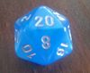

# Zusatzmaterial {-}

## Bruchrechnung kurz und knapp {-}

```{css, echo=FALSE}
.box {
        display: flex;
      }

      .box > * {
        flex: 1 1 0;
      }
```

<script language="javascript">
function toggle(num) {
var ele = document.getElementById("toggleText" + num);
var text = document.getElementById("displayText" + num);
if(ele.style.display == "block") {
ele.style.display = "none";
text.innerHTML = "show";
}
else {
ele.style.display = "block";
text.innerHTML = "hide";
}
}
</script>

### Brüche kürzen und erweitern {-}
Einen Bruch $a \over b$ mit einer Zahl $c$ **erweitern**, bedeutet, dass man **den Zähler und den Nenner** mit $c$ **multipliziert**: $a \over b$ erweitert mit $c$ ergibt also $a \cdot c \over b \cdot c$.

**Dividiert** man **Zähler und Nenner** eines Bruches $x \over y$ durch dieselbe Zahl $z$, sagt man, $x \over y$ wird mit $z$ **gekürzt**.

Ein Bruch $e \over f$ heißt **vollständig gekürzt**, wenn Zähler und Nenner teilerfremd sind. $2 \over 3$ oder $1 \over 4$ sind beispielsweise vollständig gekürzt. $9 \over 15$ dagegen nicht, da man sowohl $9$ als auch $15$ durch $3$ dividieren kann.


#### {-}

```{r, eval=knitr::opts_knit$get("rmarkdown.pandoc.to") == "html", results='asis', echo=FALSE}
cat('<hr style="background-color:#3C6690;height:2px">')
```

#### Aufgabe {-}

:::: {class="box"}
::: {}

<button id="displayText" onclick="javascript:toggle(1);">Erweitere $1 \over 5$ mit $2$</button>
<div id="toggleText1" style="display: none">

$2 \over 10$

</div>

<br>

<button id="displayText" onclick="javascript:toggle(2);">Erweitere $2 \over 3$ mit $5$</button>
<div id="toggleText2" style="display: none">

$10 \over 15$

</div>

<br>

<button id="displayText" onclick="javascript:toggle(3);">Erweitere $3 \over 4$ mit $6$</button>
<div id="toggleText3" style="display: none">

$18 \over 24$

</div>

<br>

<button id="displayText" onclick="javascript:toggle(4);">Erweitere $17 \over 19$ mit $3$</button>
<div id="toggleText4" style="display: none">

$51 \over 57$

</div>

:::

::: {}

<button id="displayText" onclick="javascript:toggle(5);">Kürze vollständig: $8 \over 12$</button>
<div id="toggleText5" style="display: none">

$2 \over 3$

</div>

<br>

<button id="displayText" onclick="javascript:toggle(6);">Kürze vollständig: $8 \over 24$</button>
<div id="toggleText6" style="display: none">

$1 \over 3$

</div>

<br>

<button id="displayText" onclick="javascript:toggle(7);">Kürze vollständig: $72 \over 48$</button>
<div id="toggleText7" style="display: none">

$3 \over 2$

</div>

<br>

<button id="displayText" onclick="javascript:toggle(8);">Kürze vollständig: $21 \over 33$</button>
<div id="toggleText8" style="display: none">

$7 \over 11$

</div>

:::

::::

#### {-}

```{r, eval=knitr::opts_knit$get("rmarkdown.pandoc.to") == "html", results='asis', echo=FALSE}
cat('<hr style="background-color:#3C6690;height:2px">')
```

#### {-}

```{r, eval=knitr::opts_knit$get("rmarkdown.pandoc.to") == "html", results='asis', echo=FALSE}
cat('<hr style="background-color:#3C6690;height:2px">')
```


### Brüche in Dezimalzahlen oder Prozentangaben umwandeln {-}
Möchte man einen Bruch als Dezimalzahl schreiben, muss man den Zähler (schriftlich oder mit Hilfe des Taschenrechners) durch den Nenner dividieren. 

Eine Dezimalzahl kann man nun wiederum sehr einfach auch als Prozentzahl angeben: Man verschiebt einfach das Komma um zwei Stellen nach rechts und schreibt hinter die auf diese Weise entstandene Zahl ein %-Zeichen.

#### {-}

```{r, eval=knitr::opts_knit$get("rmarkdown.pandoc.to") == "html", results='asis', echo=FALSE}
cat('<hr style="background-color:#3C6690;height:2px">')
```

#### Aufgabe {-}

:::: {class="box"}
::: {}

<button id="displayText" onclick="javascript:toggle(9);">Schreibe als Dezimalzahl$14 \over 10$</button>
<div id="toggleText9" style="display: none">

$1,4$

</div>

<br>

<button id="displayText" onclick="javascript:toggle(10);">Schreibe als Dezimalzahl$14 \over 100$</button>
<div id="toggleText10" style="display: none">

$0,14$

</div>

<br>

<button id="displayText" onclick="javascript:toggle(11);">Schreibe als Dezimalzahl$12 \over 15$</button>
<div id="toggleText11" style="display: none">

$0,8$

</div>

<br>

<button id="displayText" onclick="javascript:toggle(12);">Schreibe als Dezimalzahl$-{6 \over 4}$</button>
<div id="toggleText12" style="display: none">

$-1,5$

</div>

:::

::: {}

<button id="displayText" onclick="javascript:toggle(13);">Schreibe in Prozent: $7 \over 20$</button>
<div id="toggleText13" style="display: none">

$35\%$

</div>

<br>

<button id="displayText" onclick="javascript:toggle(14);">Schreibe in Prozent: $18 \over 48$</button>
<div id="toggleText14" style="display: none">

$37,5\%$

</div>

<br>

<button id="displayText" onclick="javascript:toggle(15);">Schreibe in Prozent: $19 \over 38$</button>
<div id="toggleText15" style="display: none">

$50\%$

</div>

<br>

<button id="displayText" onclick="javascript:toggle(16);">Schreibe in Prozent: $38 \over 19$</button>
<div id="toggleText16" style="display: none">

$200\%$

</div>

:::

::::


#### {-}

```{r, eval=knitr::opts_knit$get("rmarkdown.pandoc.to") == "html", results='asis', echo=FALSE}
cat('<hr style="background-color:#3C6690;height:2px">')
```

#### {-}

```{r, eval=knitr::opts_knit$get("rmarkdown.pandoc.to") == "html", results='asis', echo=FALSE}
cat('<hr style="background-color:#3C6690;height:2px">')
```

### Mit Brüchen rechnen {-}
Zwei Brüche werden **multipliziert**, indem man Zähler mit Zähler und Nenner mit Nenner multipliziert.
$${a \over b} \cdot {c \over d} = {a \cdot c \over b \cdot d} $$

Durch einen Bruch wird **dividiert**, indem **mit seinem Kehrbruch multipliziert** wird.
$${e \over f} : {x \over y} = {e \cdot y \over f \cdot x}$$

Sollen zwei Brüche **addiert** oder **subtrahiert** werden, muss man sie zunächst **auf den gleichen Nenner bringen**. Anschließend **addiert** bzw. **subtrahiert** man die Zähler.

$${m \over n}+{p \over q} = \frac{m \cdot q}{n \cdot q} + \frac{p \cdot n}{q \cdot n} = {m \cdot q + n \cdot p \over n \cdot q}$$
$${m \over n}-{p \over q} = \frac{m \cdot q}{n \cdot q} - \frac{p \cdot n}{q \cdot n} = {m \cdot q - n \cdot p \over n \cdot q}$$

#### {-}

```{r, eval=knitr::opts_knit$get("rmarkdown.pandoc.to") == "html", results='asis', echo=FALSE}
cat('<hr style="background-color:#3C6690;height:2px">')
```

#### Aufgabe {-}

:::: {class="box"}
::: {}

<button id="displayText" onclick="javascript:toggle(17);">${1 \over 3}\cdot{2 \over 7}$</button>
<div id="toggleText17" style="display: none">

$2 \over 21$

</div>

<br>

<button id="displayText" onclick="javascript:toggle(18);">$-{2 \over 5}\cdot{3 \over 4}$</button>
<div id="toggleText18" style="display: none">

$-{3 \over 10}$

</div>

<br>

<button id="displayText" onclick="javascript:toggle(19);">$7\cdot{6 \over 49}$</button>
<div id="toggleText19" style="display: none">

$6 \over 7$

</div>

<br>

<button id="displayText" onclick="javascript:toggle(20);">${3 \over 4}:{9 \over 10}$</button>
<div id="toggleText20" style="display: none">

$5 \over 6$

</div>

:::

::: {}

<button id="displayText" onclick="javascript:toggle(21);">${8 \over 9}:2$</button>
<div id="toggleText21" style="display: none">

$4 \over 9$

</div>

<br>

<button id="displayText" onclick="javascript:toggle(22);">$-{15 \over 14}:(-{10 \over 21})$</button>
<div id="toggleText22" style="display: none">

$9 \over 4$

</div>

<br>

<button id="displayText" onclick="javascript:toggle(23);">${5 \over 6}+{1 \over 4}$</button>
<div id="toggleText23" style="display: none">

$13 \over 12$

</div>

<br>

<button id="displayText" onclick="javascript:toggle(24);">${5 \over 6}-{1 \over 4}$</button>
<div id="toggleText24" style="display: none">

$7 \over 12$

</div>

:::

::: {}

<button id="displayText" onclick="javascript:toggle(25);">${12 \over 5}+3$</button>
<div id="toggleText25" style="display: none">

$27 \over 5$

</div>

<br>

<button id="displayText" onclick="javascript:toggle(26);">${2 \over 15}-{11 \over 6}$</button>
<div id="toggleText26" style="display: none">

$-{\frac{17}{10}}$

</div>

<br>

<button id="displayText" onclick="javascript:toggle(27);">${7 \over 3}+{3 \over 2}$</button>
<div id="toggleText27" style="display: none">

$23 \over 6$

</div>

<br>

<button id="displayText" onclick="javascript:toggle(28);">$4-{49 \over 64}$</button>
<div id="toggleText28" style="display: none">

$207 \over 64$

</div>

:::

::::


## Deskriptive Statistik zum Nachlesen {-}

```{css, echo=FALSE}
.box {
        display: flex;
      }

      .box > * {
        flex: 1 1 0;
      }
```

<script language="javascript">
function toggle(num) {
var ele = document.getElementById("toggleText" + num);
var text = document.getElementById("displayText" + num);
if(ele.style.display == "block") {
ele.style.display = "none";
text.innerHTML = "show";
}
else {
ele.style.display = "block";
text.innerHTML = "hide";
}
}
</script>

Hätten wir die letzten Monate Präsenzunterricht machen dürfen, hätten wir eine Klassenarbeit über das letzte Thema geschrieben. Schön wäre das gewesen, dann hätten wir jetzt ein Häkchen machen können und gut gelaunt die ersten Frühlingstage verbracht. 

Frau D. säße jetzt zuhause in ihrer Küche und würde all die Arbeiten korrigieren. Jedes Mal wenn sie mit einer Arbeit fertig wäre, würde sie die Note auf den dafür vorgesehenen Schmierzettel schreiben. So sähe dieser Schmierzettel dann vielleicht aus:

```{css, echo=FALSE}
#schmierzettel{
    background-color: yellow;
    width: 320px;
    height: 50px;
    border: 1px solid black;
    padding: 10px;
    border-radius: 10px 10px 10px 10px;
}
```


<html>
<head>
    <meta charset="UTF-8">
    <title>Noten</title>
    <link href="css-box-modell.css" rel="stylesheet">
</head>
<body>

<div id="schmierzettel", color="yellow">
    3 3 1 6 4 3 2 1 4 4 3 5 2 2 5 4 4 5 3 4 2 4 
</div>

</body>
</html>


Einen solchen Schmierzettel bezeichnet man in der Statistik als **Urliste**. Auf ihr werden die Ergebnisse einer statistischen Erhebung in der Reihenfolge fesgehalten, in der sie eben auftreten. Daher ist eine **Urliste** in der Regel unsortiert. 

Ordnet man nun die auf der Urliste festgehaltenen Ergebnisse der Größe nach, erhält man eine **Rangliste**. Wollte Frau D. diese erstellen, sähe sie für das obige Beispiel so aus:

<html>
<head>
    <meta charset="UTF-8">
    <title>Noten</title>
    <link href="css-box-modell.css" rel="stylesheet">
</head>
<body>

<div id="schmierzettel", color="yellow">
    1 1 2 2 2 2 3 3 3 3 3 4 4 4 4 4 4 4 5 5 5 6 
</div>

</body>
</html>

<br>

Aber auch diese - schon etwas ordentlichere - Liste würde euch Frau D. nicht als Ergebnisspiegel präsentieren. Hier hat sich die **Häufigkeitsliste** durchgesetzt. Auf ihr gibt man zu jedem der möglichen Werte an, wie oft er vorkommt.

Und da sind wir schon bei zwei für dieses Kapitel zentralen Begriffen...

### Absolute und relative Häufigkeiten ermitteln {-}
Die Anzahl, mit der ein Wert in der erhobenen Urliste vorkommt, heißt **absolute Häufigkeit** des Wertes. Der Anteil, den die absolute Häufigkeit an der Gesamtzahl der erhobenen Daten hat, heißt **relative Häufigkeit**.

Zwischen der **absoluten** und der **relativen** Häufigkeit besteht also der folgende Zusammenhang:

$$relative \; Häufigkeit = \frac{absolute \; Häufigkeit}{Gesamtzahl\; der\; erhobenen\; Daten}$$

An unserem Notenbeispiel kann man sich das gut verdeutlichen:

<html>
<head>
    <meta charset="UTF-8">
    <title>Noten</title>
    <link href="css-box-modell.css" rel="stylesheet">
</head>
<body>

<div id="schmierzettel", color="yellow">
    3 3 1 6 4 3 2 1 4 4 3 5 2 2 5 4 4 5 3 4 2 4 
</div>

</body>
</html>

<br>

Die **absolute Häufigkeit** der Note Eins etwa ist $2$. Die **absolute Häufigkeit** der Note Vier dagegen ist $7$.

Wenn ich mich nicht verzählt habe, haben $22$ Schüler:innen an der Klasenarbeit teilgenommen. Damit erhält man für die Note Eins eine **relative Häufigkeit** von $\frac{2}{22} = \frac{1}{11}$ und für die Note Vier eine **relative Häufigkeit** von $\frac{7}{22}$.

#### {-}

```{r, eval=knitr::opts_knit$get("rmarkdown.pandoc.to") == "html", results='asis', echo=FALSE}
cat('<hr style="background-color:#3C6690;height:2px">')
```

#### Aufgabe 1 {-}
Frau D. hat eine Klassenarbeit korrigiert, an der 26 Schüler:innen teilgenommen haben. Sie hatte auch bereits eine **Häufigkeitstabelle** erstellt, um eine Übersicht über die Ergebnisse zu erhalten. Leider hat eins ihrer Kinder ein Glas Wasser darüber gekippt. Nun kann man die Hälfte nicht mehr lesen...

```{r, 'kable'}
```
Note               | 1     | 2   | 3   |  4  |  5  |  6  
-------------------|-------|-----|-----|-----|-----|-----
absolute Häufigkeit|  2    | ???    |  10 | ???    |  ???   | 1
relative Häufigkeit|  ???     | 0,27|  ???   | 0,15| 0,08|???

Vervollständige die Tabelle. Gib **relative Häufigkeiten** auf zwei Nachkommastellen genau an und **absolute Häufigkeiten** als ganze Zahlen.


#### {-}

```{r, eval=knitr::opts_knit$get("rmarkdown.pandoc.to") == "html", results='asis', echo=FALSE}
cat('<hr style="background-color:#3C6690;height:2px">')
```

#### Aufgabe 2 {-}
Beim Torwandschießen wurde die Anzahl der Treffer notiert. Wer hat die beste Torquote?


```{r, 'kable'}
```
<br>               | Anzahl der Schüsse     | Anzahl der Treffer    
-------------------|------------------------|-------------------
R. Lewandowski | $\quad\quad\quad 32$ | $\quad\quad\quad 17$    
D. Alaba |$\quad\quad\quad 53$ | $\quad\quad\quad 30$
L. Sane | $\quad\quad\quad 16$ | $\quad\quad\quad 9$
Th. Müller | $\quad\quad\quad 27$ | $\quad\quad\quad 16$
J. Kimmich |$\quad\quad\quad 52$ | $\quad\quad\quad 29$


`r hide("Tipp")`

Als Torquote bezeichnet man das Verhältnis von getroffenen Toren zur Gesamtanzahl der Schüsse. Wenn du also etwa bei fünf Schüssen dreimal das Tor triffst, dann hast du eine Torquote von $\frac{3}{5}=0,6$.


#### {-}

```{r, eval=knitr::opts_knit$get("rmarkdown.pandoc.to") == "html", results='asis', echo=FALSE}
cat('<hr style="background-color:#3C6690;height:2px">')
```

#### Aufgabe 3{-}
Eine Klasse mit 28 Schüler:innen, von denen 16 Mädchen sind,  wird nach ihren Vorlieben und Abneigungen befragt. Dabei geben 14 Schüler:innen an, dass Mathe ihr Lieblingsfach sei. Ein erster Blick auf die erhobenen Daten verrät zudem, dass unter den Matheliebhabern 6 Jungen sind.

Entscheide begründet: Ist Mathe nun bei den Mädchen oder bei den Jungen beliebter?

#### {-}

```{r, eval=knitr::opts_knit$get("rmarkdown.pandoc.to") == "html", results='asis', echo=FALSE}
cat('<hr style="background-color:#3C6690;height:2px">')
```

#### {-}

```{r, eval=knitr::opts_knit$get("rmarkdown.pandoc.to") == "html", results='asis', echo=FALSE}
cat('<hr style="background-color:#3C6690;height:2px">')
```


### Häufigkeiten in Tabellen, Säulen- und Kreisdiagrammen darstellen {-}

Mit Tabellen und Diagrammen kann man erfasste Werte veranschaulichen. Neben Tabellen hast du sicherlich mindestens **Säulen-** und **Kreisdiagramme** kennengelernt.

In **Säulendiagrammen** kann man die **absoluten Häufigkeiten** der Werte ablesen. **Kreisdiagramme** verdeutlichen dagegen den **Anteil** den ein Wert an der Gesamtheit hat.

Du erinnerst dich, dass Frau D. die Noten, die sie mit ihrer ausgefallenen Klassenarbeit erhoben hat auf einer **Urliste** notiert hat.


```{css, echo=FALSE}
#schmierzettel{
    background-color: yellow;
    width: 320px;
    height: 50px;
    border: 1px solid black;
    padding: 10px;
    border-radius: 10px 10px 10px 10px;
}
```


<html>
<head>
    <meta charset="UTF-8">
    <title>Noten</title>
    <link href="css-box-modell.css" rel="stylesheet">
</head>
<body>

<div id="schmierzettel", color="yellow">
    3 3 1 6 4 3 2 1 4 4 3 5 2 2 5 4 4 5 3 4 2 4 
</div>

</body>
</html>

<br>

Um die Mathelage besser einschätzen zu können, greift Frau D. nun in die Trickkiste der deskriptiven (das heißt beschreibenden) Statistik:

Zunächst bringt sie Ordnung ins Chaos, indem sie die Daten tabellarisch darstellt.

```{r, echo=FALSE}
Noten <- c(1,1,2,2,2,2,3,3,3,3,3,4,4,4,4,4,4,4,5,5,5,6)

noten_df <- as.data.frame(as.list(table(Noten)))
colnames(noten_df) <- as.character(1:6)
rownames(noten_df) <- "Anzahl"

kbl(noten_df)
```

Um einen besseren Eindruck von der Verteilung der Daten zu bekommen, fertigt sie nun ein **Säulendiagramm** an.

```{r, echo=FALSE}
barplot(table(Noten))
```

Schließlich lässt sie sich von ihrem Rechner noch ein **Kreisdiagramm** erstellen, um eine bildlichere Vorstellung von der relativen Häufigkeit der Noten zu bekommen. 

Beim Kreisdiagramm werden Anteile durch passende Winkel am Mittelpunkt des Kreises dargestellt. Der Vollkreis hat 360°. Einer relativen Häufigkeit von $1\%$ entspricht also ein Kreissektor mit einem Mittelpunktswinkel von $360° \cdot {1 \over 100} = 3,6°$. Einer relativen Häufigkeit von $30\%$ entspricht damit ein Kreissektor mit einem Mittelpunktswinkel von $30 \cdot 3,6° = 108°$

```{r, echo=FALSE}
pie(table(Noten))
```

#### {-}

```{r, eval=knitr::opts_knit$get("rmarkdown.pandoc.to") == "html", results='asis', echo=FALSE}
cat('<hr style="background-color:#3C6690;height:2px">')
```

#### Aufgabe 1 {-}
In einer Mathearbeit gab es folgende Noten:

<html>
<head>
    <meta charset="UTF-8">
    <title>Noten</title>
    <link href="css-box-modell.css" rel="stylesheet">
</head>
<body>

<div id="schmierzettel", color="yellow">
    1  3  3  2  2  3  3  4  2  1  3  4  4  3 3  
</div>

</body>
</html>

<br>

Erstelle ein Säulen- und ein Kreisdiagramm für die Verteilung der Noten. Du kannst diese Aufgabe per Hand oder mit dem Computer lösen.

`r hide("Tipp")`

Für das Kreisdiagramm musst du die relativen Häufigkeiten berechnen.


#### {-}

```{r, eval=knitr::opts_knit$get("rmarkdown.pandoc.to") == "html", results='asis', echo=FALSE}
cat('<hr style="background-color:#3C6690;height:2px">')
```

#### Aufgabe 2 {-}
Bei einer Umfrage unter echten Kerlen ergab sich, dass sich $80\%$ für Fußball interessieren, $10\%$ gerne Motorrad fahren, $10\%$ schnelle Autos lieben, sich $5\%$ für Fußball und schnelle Autos interessieren und $3\%$ Fussball und ihr Motorrad lieben. 

Die Aufgabe lautet: Stelle diesen Sachvervhalt in einem Kreisdiagramm dar. 

Anton zeichnet sofort los. Doch schon nach den ersten drei Angaben ist der Kreis "voll". Er jammert. Seine kleine Schwester sieht sich seinen Kreis an. Ziemlich schnell hat sie entdeckt, wie man das Problem lösen kann. Dazu muss sie nicht einmal einen neuen Kreis zeichnen.

Was tut sie?


#### {-}

```{r, eval=knitr::opts_knit$get("rmarkdown.pandoc.to") == "html", results='asis', echo=FALSE}
cat('<hr style="background-color:#3C6690;height:2px">')
```

#### {-}

```{r, eval=knitr::opts_knit$get("rmarkdown.pandoc.to") == "html", results='asis', echo=FALSE}
cat('<hr style="background-color:#3C6690;height:2px">')
```


### Das arithmetische Mittel, die Spannweite und den Median angeben {-}
Um kurze und prägnante (oft auch zu kurze!) Aussagen mit Hilfe der erhobenen Daten treffen zu können, bedient man sich der statistischen **Kennwerte**. Auch von diesen kennst du schon einige.

Das **arithmetische Mittel** beispielsweise ist Bestandteil des Alltags: Wenn wir vom "Durchschnitt" sprechen, meinen wir meist arithmetische Mittelwerte. Du erwartest ihn vermutlich auch als Angabe unter einer Klassenarbeit.

Das **arithmetische Mittel** berechnet man als **die Summe aller Werte durch die Anzahl der Werte**. Sehen wir uns als Beispiel die Fehleranzahl von 5 Grundschüler:innen in einem Diktat an.

```{r, 'kable'}
```
<br>               | Anzahl der Fehler     
-------------------|---------------------
Anna | $\quad\quad\quad 0$    
Barbara |$\quad\quad\quad 2$ 
Claire | $\quad\quad\quad 4$ 
Dennis | $\quad\quad\quad 3$ 
Enno |$\quad\quad\quad 5$ 

Das **arithmetische Mittel** ergibt sich also hier wie folgt:
$$\bar{x} = \frac{0+2+4+3+5}{5} = \frac{14}{5} =2,8$$

Das **arithmetische Mittel** hat allerdings einen kleinen Schwachpunkt. Es lässt sich - wie man sagt - von Ausreißern beeinflussen. Was das heißt, erkennt man ganz gut in dem Fall, in dem der arme Enno nicht ein einziges Wort richtig geschrieben hat...

```{r, 'kable'}
```
<br>               | Anzahl der Fehler     
-------------------|---------------------
Anna | $\quad\quad\quad 0$    
Barbara |$\quad\quad\quad 2$ 
Claire | $\quad\quad\quad 4$ 
Dennis | $\quad\quad\quad 3$ 
Enno |$\quad\quad\quad 131$ 

Wenn der Grundschullehrer nun in einer Konferenz besorgt mitteilen würde, dass die Kinder im Diktat im Durchschnitt 28 Fehler machen, wäre dies sicher keine angemessene Aussage über die tatsächliche Leistung der Schüler:innen. Während Anna, Barbara, Claire und Dennis viel zu schlecht dastünden, käme Enno wiederum viel zu gut weg.


Diesen Nachteil hat der **Median** nicht (er hat andere). Der **Median** ist der Wert in der Mitte einer Rangliste. Hat die Rangliste eine ungerade Anzahl von Werten, so ist der mittlere Wert der **Median**. Hat die Rangliste eine gerade Anzahl von Werten, so bildet man den Mittelwert der beiden Werte in der Mitte.

Was heißt das?

Zunächst muss man also die Urliste der Größe nach sortieren. Für die fünf Grundschüler:innen erhält man dann je nach Szenarion
$$0;\; 2;\; \color{red}{3};\; 4;\; 5$$
oder
$$0;\; 2;\; \color{red}{3};\; 4;\; 131$$
Als Median erhält man also in beiden Fällen den Wert 3.

Und ja: Mehr muss man nicht tun. Man sortiert alle Werte der Größe nach und ermittelt den mittleren Wert. 

Hätte nun auch noch Fritz am Diktat teilgenommen und ebenfalls 0 Fehler geschrieben, so sähe die Liste also wie folgt aus:
$$0;\;0;\; \color{red}{2};\; \color{red}{3};\; 4;\; 131$$
Der **Median** ist in diesem Fall definiert, als der Mittelwert aus den beiden mittleren Werten. In obigem Beispiel also $\frac{2+3}{2}=2,5$

Das **arithmetische Mittel** und der **Median** geben also Auskunft über den Durchschnitt. Der Durchschnitt alleine ist allerdings gar nicht unbedingt aussagekräftig.

Frau D. hat in zwei Parallelklassen eine Mathearbeit schreiben lassen. Wie es der Teufel will, kann sie in beiden Fällen stolz auf einen Durchschnitt von $3,0$ blicken...

Dass dies aber keineswegs bedeutet, dass die Klassenarbeiten gleich ausgefallen sein müssen, zeigt ein kurzer Blick auf die Notenverteilungen...

Bei der Klasse 8x scheint es sich um eine sehr homogene Lerngruppe zu handeln:

```{r, echo=FALSE}
Noten <- factor(rep(3, 10), levels = c(1:6))

barplot(table(Noten))
```


Die Klasse 8y dagegen besticht durch ihre große **Spannweite**

```{r, echo=FALSE}
Noten <- factor(c(rep(1, 18), rep(6,12)), levels = c(1:6))

barplot(table(Noten))
```

Unter der **Spannweite** versteht man die Differenz aus dem größten und kleinsten Wert. Im Fall der Klasse 8x ist die Spannweite $3-3=0$. Für die Klasse 8y ist sie $6-1=5$. Wie auch bei der Berechnung des Mittelwerts kann ein Ausreißer für eine große Spannweite sorgen. 

Um erhobene Daten kurz und prägnant zu beschreiben, ist es sinnvoll, neben der Angabe eines durchschnittlichen Wertes (Median oder Mittelwert), auch anzugeben, welche **Spannweite** die Daten haben. 

#### {-}

```{r, eval=knitr::opts_knit$get("rmarkdown.pandoc.to") == "html", results='asis', echo=FALSE}
cat('<hr style="background-color:#3C6690;height:2px">')
```

#### Aufgabe 1 {-}
In einer Mathearbeit gab es folgende Noten:

<html>
<head>
    <meta charset="UTF-8">
    <title>Noten</title>
    <link href="css-box-modell.css" rel="stylesheet">
</head>
<body>

<div id="schmierzettel", color="yellow">
    1  3  3  2  2  3  3  4  2  1  3  4  4  3 3  
</div>

</body>
</html>

<br>

Gib das arithmetische Mittel, die Spannweite und den Median an.

#### {-}

```{r, eval=knitr::opts_knit$get("rmarkdown.pandoc.to") == "html", results='asis', echo=FALSE}
cat('<hr style="background-color:#3C6690;height:2px">')
```

#### Aufgabe 2 {-}
:::: {style="display: flex;"}

::: {}

Die Klasse 8x besteht aus 24 Schüler:innen. Das Kreisdiagramm enthält Informationen über das Alter der Schüler:innen.

:::

::: {}

```{r, echo=FALSE}
Alter <- c(11, 11, 11, 11, 13, 13, 13, 13, 13, 13, 13, 13, 12, 12, 12, 12, 12, 12, 12, 12, 12, 12, 12, 12)

pie(table(Alter))
```

:::

::::

a) Gib das durchschnittliche Alter an.

b) Ermittle, wie sich der Altersdurchschnitt ändert, wenn zwei 11-jährige Schüler die 8x verlassen und eine 14-jährige Schülerin neu in die Klasse kommt.

#### {-}

```{r, eval=knitr::opts_knit$get("rmarkdown.pandoc.to") == "html", results='asis', echo=FALSE}
cat('<hr style="background-color:#3C6690;height:2px">')
```

#### {-}

```{r, eval=knitr::opts_knit$get("rmarkdown.pandoc.to") == "html", results='asis', echo=FALSE}
cat('<hr style="background-color:#3C6690;height:2px">')
```

### Box-Plots interpretieren und erstellen {-}
Neben der Möglichkeit erhobene Daten in Form einer **Tabelle**, eines **Säulen-** oder eines **Kreisdiagramms** darzustellen, solltest in der 7. Klasse auch die Darstellung in Form eines **Boxplots** kennengelernt haben.

Ein Boxplot enthält sowohl Information über einen durchschnittlichen Wert, als auch darüber, welche Spannweite die Daten vorweisen. Daher ist er von allen Darstellungsformen, die dir bisher begegnet sind, die aussagekräftigste.

Anhand der ausgefallenen Mathearbeit soll er hier kurz wiederholt werden.

```{r, echo=FALSE}
Noten <- c(1,1,2,2,2,2,3,3,3,3,3,4,4,4,4,4,4,4,5,5,5,6)

boxplot(as.numeric(Noten))
text(y=quantile(as.numeric(Noten), prob=0.75), x=1.35, labels = "3. Quartil")
text(y=quantile(as.numeric(Noten), prob=0.50), x=0.65, labels = "Median")
text(y=quantile(as.numeric(Noten), prob=0.25), x=1.35, labels = "1. Quartil")
```

Die Box wird dabei begrenzt durch das **1.** und **3. Quartil**. Das **1. Quartil** ist der mittlere Wert der unteren Datenhälfte, das **3. Quartil** ist der mittlere Wert der oberen Datenhälfte. Unterteilt wird die Box durch den **Median**.

Im Beispiel der Mathearbeit sind das folgende Werte:

$$1\;,1\;,2\;,2\;,2\;,\color{red}{2}\;,3\;,3\;,3\;,3\;,3\;,\color{red}{\frac{3+4}{2}},4\;,4\;,4\;,4\;,4\;,\color{red}{4}\;,4\;,5\;,5\;,5\;,6$$

Damit liegen $50%$ der Werte in der Box! Sie gibt also eine guten Eindruck davon, welche Werte oft vertreten waren. Gleichzeitig kann man an der Größe der Box auf einen Blick abschätzen wie groß die Spannweite sein könnte.

Die Querstriche am oberen und unteren Ende bezeichnet man als **Zäune**. In unseren Beispielen genügt es, für den unteren **Zaun** den kleinesten und für den oberen **Zaun** den größten Wert zu wählen.

#### {-}

```{r, eval=knitr::opts_knit$get("rmarkdown.pandoc.to") == "html", results='asis', echo=FALSE}
cat('<hr style="background-color:#3C6690;height:2px">')
```

#### Aufgabe 1 {-}
Wie sieht ein Boxplot aus, wenn

a) alle 30 Zahlen den Wert 3 besitzen (siehe Klasenarbeit der Klasse 8x)?

b) 12 Zahlen den Wert 6 und 18 Zahlen den Wert 1 haben (siehe Klassenarbeit der Klasse 8y)?

c) Wie könnte die Datenliste aussehen, wenn die Box des Boxplots die Länge 0 hat und der Abstand der beiden Zäune 10 sein soll?

#### {-}

```{r, eval=knitr::opts_knit$get("rmarkdown.pandoc.to") == "html", results='asis', echo=FALSE}
cat('<hr style="background-color:#3C6690;height:2px">')
```

#### Aufgabe 2 {-}
Die folgende Liste zeigt, wie lange Hugo beim Würfeln jeweils auf die erste 6 warten musste.
$$1\;, 5\;, 11\;, 4\;, 15\;, 3\;, 7\;, 6\;, 1\;, 3\;, 1\;, 4$$

Stelle die Ergebnisse mit Hilfe eines Boxplottes dar.

#### {-}

<!-- ```{r, echo=FALSE} -->
<!-- Noten <- c(1,1,2,2,2,2,3,3,3,3,3,4,4,4,4,4,4,4,5,5,5,6) -->
<!-- Noten <- factor(rep(3, 10), levels = c(1:6)) -->
<!-- Noten <- factor(c(rep(1, 18), rep(6,12)), levels = c(1:6)) -->

<!-- noten_df <- as.data.frame(as.list(table(Noten))) -->
<!-- colnames(noten_df) <- as.character(1:6) -->
<!-- rownames(noten_df) <- "Anzahl" -->

<!-- kbl(noten_df) -->

<!-- pie(table(Noten)) -->

<!-- barplot(table(Noten)) -->


<!-- boxplot(as.numeric(Noten)) -->
<!-- text(y=quantile(as.numeric(Noten), prob=0.75), x=1.35, labels = "3. Quartil") -->
<!-- text(y=quantile(as.numeric(Noten), prob=0.50), x=0.65, labels = "Median") -->
<!-- text(y=quantile(as.numeric(Noten), prob=0.25), x=1.35, labels = "1. Quartil") -->
<!-- ``` -->


## Wahrscheinlichkeit - da war doch was {-}

### Zufallsexperimente erkennen {-}
Ein Zufallsexperiment liegt vor, wenn folgende vier Bedingungen erfüllt sind:

+ Das Zufallsexperiment kann verschiedene Ergebnisse haben.

+ Alle möglichen Ergebnisse können vor dem Experiment angegeben werden.

+ Welches Ergebnis eintreten wird, lässt sich nicht mit Sicherheit voraussagen.

+ Das Experiment kann unter gleichen Bedingungen beliebig oft wiederholt werden.


Beispiele für Zufallsexperimente sind:

Würfeln, eine Münze werfen, Lotto spielen, einen Gegenstand blind aus einem Sack ziehen....

#### {-}

```{r, eval=knitr::opts_knit$get("rmarkdown.pandoc.to") == "html", results='asis', echo=FALSE}
cat('<hr style="background-color:#3C6690;height:2px">')
```

#### Aufgabe 1 {-}
Ein Zufallsexperiment ist ein Vorgang, dessen `r mcq(c("Sudoku spielen", "gleichen", "beliebig oft", answer="Ausgang", "mehrere", "Würfel zu werfen", "Zufallsexperiment", "vorhersagen"))` man nicht `r mcq(c("Sudoku spielen", "gleichen", "beliebig oft", "Ausgang", "mehrere", "Würfel zu werfen", "Zufallsexperiment", answer="vorhersagen"))` kann. Bei einem `r mcq(c("Sudoku spielen", "gleichen", "beliebig oft", "Ausgang", "mehrere", "Würfel zu werfen", answer="Zufallsexperiment", "vorhersagen"))` sollen `r mcq(c("Sudoku spielen", "gleichen", "beliebig oft", "Ausgang", answer="mehrere", "Würfel zu werfen", "Zufallsexperiment", "vorhersagen"))` Ausgänge möglich sein und es soll `r mcq(c("Sudoku spielen", "gleichen", answer="beliebig oft", "Ausgang", "mehrere", "Würfel zu werfen", "Zufallsexperiment", "vorhersagen"))` unter den `r mcq(c("Sudoku spielen", answer="gleichen", "beliebig oft", "Ausgang", "mehrere", "Würfel zu werfen", "Zufallsexperiment", "vorhersagen"))` Bedingungen wiederholbar sein.

Eine Münze oder `r mcq(c("Sudoku spielen", "gleichen", "beliebig oft", "Ausgang", "mehrere", answer="Würfel zu werfen", "Zufallsexperiment", "vorhersagen"))` zählen zu Zufallsexperimenten. `r mcq(c(answer="Sudoku spielen", "gleichen", "beliebig oft", "Ausgang", "mehrere", "Würfel zu werfen", "Zufallsexperiment", "vorhersagen"))` ist kein Zufallsexperiment, da kein Zufall im Spiel ist.

#### {-}

```{r, eval=knitr::opts_knit$get("rmarkdown.pandoc.to") == "html", results='asis', echo=FALSE}
cat('<hr style="background-color:#3C6690;height:2px">')
```

#### Aufgabe 2 {-}
Entscheide, ob es sich um ein Zufallsexperiment handelt.

+ Lose ziehen `r mcq(c(answer="Ja, das ist ein Zufallsexperiment", "Nein, das ist kein Zufallsexperiment"))`

+ Würfeln `r mcq(c(answer="Ja, das ist ein Zufallsexperiment", "Nein, das ist kein Zufallsexperiment"))`

+ Die Temperatur bestimmen, bei der Eis schmilzt `r mcq(c("Ja, das ist ein Zufallsexperiment", answer="Nein, das ist kein Zufallsexperiment"))`

+ Blind eine Spielkarte aus einem Kartendeck ziehen `r mcq(c(answer="Ja, das ist ein Zufallsexperiment", "Nein, das ist kein Zufallsexperiment"))`

+ Die Innenwinkelsumme eines zufälligen Dreiecks bestimmen `r mcq(c("Ja, das ist ein Zufallsexperiment", answer="Nein, das ist kein Zufallsexperiment"))`

#### {-}

```{r, eval=knitr::opts_knit$get("rmarkdown.pandoc.to") == "html", results='asis', echo=FALSE}
cat('<hr style="background-color:#3C6690;height:2px">')
```

#### {-}

```{r, eval=knitr::opts_knit$get("rmarkdown.pandoc.to") == "html", results='asis', echo=FALSE}
cat('<hr style="background-color:#3C6690;height:2px">')
```


### Die Ergebnismenge eines einfachen Zufallsexperiments {-}
Bei einem Zufallsexperiment werden die möglichen Ausgänge als **Ergebnisse** bezeichnet. Die Menge der möglichen Ausgänge bezeichnet man als **Ergebnismenge**. Sie fasst alle Ausgänge eines Zufallexperiments zusammen. 

Schreibweise: $\Omega = \{a,\;b,\;c\}$ "Die Ergebnismenge *Omega* besteht aus den Ergebnissen a, b und c.

Beispiele:

+ Eine Münze werfen hat die Ergebnismenge: $\Omega=\{Kopf,\; Zahl\}$

+ Würfeln hat die Ergebnismenge: $\Omega=\{1\;, 2,\; 3,\;4,\;5,\;6\}$

+ Eine ungerade Zahl würfeln hat die Ergebnismenge: $\Omega=\{1\;, 3\;, 5\}$

#### {-}

```{r, eval=knitr::opts_knit$get("rmarkdown.pandoc.to") == "html", results='asis', echo=FALSE}
cat('<hr style="background-color:#3C6690;height:2px">')
```

#### Aufgabe 1 {-}
Notiere die Ergebnismengen für folgende Zufallsexperimente:

:::: {style="display: flex;"}

::: {}

<br><br>

a) Würfeln mit folgenden Würfeln

:::

::: {}




:::

::::

:::: {style="display: flex;"}

::: {}

<br><br>

b) Man dreht folgende Glücksräder

:::

::: {}


:::

::::

c) Man würfelt zwei "normale" Würfel und bildet anschließend die Augensumme.

#### {-}

```{r, eval=knitr::opts_knit$get("rmarkdown.pandoc.to") == "html", results='asis', echo=FALSE}
cat('<hr style="background-color:#3C6690;height:2px">')
```

#### Aufgabe 2 {-}
Beschreibe passende Zufallsexperimente für folgende Ergebnismengen.

a) $\Omega = \{weiß,\; schwarz,\; rot,\; blau \}$

b) $\Omega = \{Niete,\; kleiner\;Gewinn,\; mittlerer\;Gewinn,\; großer\;Gewinn \}$

c) $\Omega = \{Song1,\; Song2,\; Song3,\; Song4 \}$

#### {-}

```{r, eval=knitr::opts_knit$get("rmarkdown.pandoc.to") == "html", results='asis', echo=FALSE}
cat('<hr style="background-color:#3C6690;height:2px">')
```

#### {-}

```{r, eval=knitr::opts_knit$get("rmarkdown.pandoc.to") == "html", results='asis', echo=FALSE}
cat('<hr style="background-color:#3C6690;height:2px">')
```


### Die Wahrscheinlichkeit eines Ereignisses {-}
Ein Ereignis ist eine Teilmenge der Ergebnismenge. Ein Ereignis ist also ein möglicher Ausgang eines Zufallsexperiments, der aus einem oder mehreren Ergebnissen besteht.

Mehrere Ergebnisse können somit zu einem **Ereignis** zusammengefasst werden. Die Wahrscheinlichkeit dieses Ereignisses ist dabei die Summe der Wahrscheinlichkeiten der zugehörigen Ergebnisse (**Summenregel**).

Schreibweise: $E=\{a\;,b\;,c\}$ 

Beispiele:

+ Das Würfeln einer geraden Zahl kann geschrieben werden als $E=\{2,\;4,\;6\}$ und hat die Wahrscheinlichkeit:
$$P(2)+P(4)+P(6) = \frac{1}{6}+\frac{1}{6}+\frac{1}{6}=\frac{3}{6}=\frac{1}{2}$$

+ Das Würfeln einer Zahl kleiner 3 kann geschrieben werden als $E=\{1,\;2\}$ und hat die Wahrscheinlichkeit:
$$P(1)+P(2) = \frac{1}{6}+\frac{1}{6}=\frac{2}{6}=\frac{1}{3}$$
Es gibt drei besondere Ereignisse:

+ Das **Elementarereignis**: Es enthält **nur ein** Ergebnis. [Eine 1 würfeln oder "Kopf" werfen.]

+ Das **sichere Ereignis**: Es enthält **alle** möglichen Ergebnisse und hat daher die Wahrscheinlichkeit 1. [Eine 1, 2, 3, 4, 5 oder 6 würfeln. "Kopf" oder "Zahl" werfen.]

+ Das **unmögliche Ereignis**: Es enthält **kein** Ergebnis. [Eine 8 würfeln oder "Rand" werfen.]

#### {-}

```{r, eval=knitr::opts_knit$get("rmarkdown.pandoc.to") == "html", results='asis', echo=FALSE}
cat('<hr style="background-color:#3C6690;height:2px">')
```

#### Aufgabe 1 {-}
Du hast folgende Urne. In ihr sind verschieden farbige, nummerierte Kugeln.


Als Zufallsexperiment zieht man nun eine Kugel aus der Urne. Formuliere Ereignisse, die folgende Eigenschaften erfüllen.

a) Die Ereignismenge umfasst 3 Ergebnisse.

b) Die Ereignismenge umfasst kein Ergebnis.

c) Die Ereignismenge umfasst 4 Ergebnisse.

d) Die Ereignismenge umfasst ein Ergebnis.

e) Die Ereignismenge umfasst 6 Ergebnisse.

#### {-}

```{r, eval=knitr::opts_knit$get("rmarkdown.pandoc.to") == "html", results='asis', echo=FALSE}
cat('<hr style="background-color:#3C6690;height:2px">')
```

#### Aufgabe 2 {-}
Schreibe die Ereignismengen zu folgenden Ereignissen auf.

a) Bei einem Würfelwurf fällt eine ungerade Zahl.

b) Beim Roulett wird kein schwarzes und kein rotes Feld getroffen.

c) Alle möglichen Geburtstage im Monat Februar für die gilt, dass sie nach dem 29.2. stattfinden.

d) Aus einem Skatspiel (32 Karten) wird entweder eine Herz-Karte gezogen oder ein Ass.
 

#### {-}

```{r, eval=knitr::opts_knit$get("rmarkdown.pandoc.to") == "html", results='asis', echo=FALSE}
cat('<hr style="background-color:#3C6690;height:2px">')
```

#### Aufgabe 3 {-}
Formuliere zu den folgenden zu einem Würfelwurf gehörenden Ereignismengen passende Ereignisse.

a) $E=\{1,\;2,\;3\}$

b) $E=\{2,\;4,\;6\}$

c) $E=\{1\}$

d) $E=\{5,\;6\}$


#### {-}

```{r, eval=knitr::opts_knit$get("rmarkdown.pandoc.to") == "html", results='asis', echo=FALSE}
cat('<hr style="background-color:#3C6690;height:2px">')
```

#### {-}

```{r, eval=knitr::opts_knit$get("rmarkdown.pandoc.to") == "html", results='asis', echo=FALSE}
cat('<hr style="background-color:#3C6690;height:2px">')
```


### Eigenschaften der Wahrscheinlichkeit {-}

+ Die Wahrscheinlichkeit eines Ereignisses liegt immer **zwischen 0 und 1**. Dabei bedeutet eine Wahrscheinlichkeit von 0, dass das Ereignis **sicher nicht** eintreten kann. Es ist ein **unmögliches Ereignis**. Bei einer Wahrschenlichkeit von 1 wiederum trifft das Ereignis **sicher** ein. Das bezeichnet man als **sicheres Ereignis**.

+ Die Summe der Wahrscheinlichkeiten **aller möglichen Ergebnisse** eines Zufallsexperiments ist 1.

+ Es gilt die **Summenregel**: Die Wahrscheinlichkeit eines Ereignisses ist die Summe der Wahrscheinlichkeiten der zugehörigen Ergebnisse.

Schreibweise: $P(A)=0,5$ "Die Wahrscheinlichkeit des Ereignisses A ist 0,5."

Vielleicht hilft es...:

Zur Veranschaulichung von Wahrscheinlichkeiten kann man sich z.B. einen Maßstab vorstellen:


#### {-}

```{r, eval=knitr::opts_knit$get("rmarkdown.pandoc.to") == "html", results='asis', echo=FALSE}
cat('<hr style="background-color:#3C6690;height:2px">')
```

#### {-}

```{r, eval=knitr::opts_knit$get("rmarkdown.pandoc.to") == "html", results='asis', echo=FALSE}
cat('<hr style="background-color:#3C6690;height:2px">')
```


### Das empirische Gesetz der großen Zahlen {-}
Wird ein Zufallsexperiment sehr oft durchgeführt, so **stabilisieren sich die relativen Häufigkeiten** eines Ergebnisses um einen festen Wert. Dieser Wert kann dann als **Schätzwert** für die Wahrscheinlichkeit des Ergebnisses verwendet werden.

Umgekehrt gilt:

Ist die Wahrscheinlichkeit eines Ergebnisses aus theoretischen Überlegungen bekannt (beispielsweise muss die Wahrscheinlichkeit mit einem fairen Würfel eine 1 zu würfeln $1 \over 6$ sein, da alle Augenzahlen gleich wahrscheinich sein müssen) - dann gibt diese Wahrscheinlichkeit an, **welche relative Häufigkeit** eines Ergebnisses bei sehr vielen Wiederholungen **erwartbar ist**.

#### {-}

```{r, eval=knitr::opts_knit$get("rmarkdown.pandoc.to") == "html", results='asis', echo=FALSE}
cat('<hr style="background-color:#3C6690;height:2px">')
```

#### {-}

```{r, eval=knitr::opts_knit$get("rmarkdown.pandoc.to") == "html", results='asis', echo=FALSE}
cat('<hr style="background-color:#3C6690;height:2px">')
```

### Laplace-Experimente und ihre Wahrscheinlichkeiten {-}
Ein Zufallsexperiment, bei dem **alle Ergebnisse die gleiche Wahrscheinlichkeit** haben, heißt **Laplace-Experiment**. Sind n Ergebnisse möglich, so ist die Wahrscheinlichkeit jedes einzelnen Ergebnisses $1 \over n$.


Beispiele für Laplace-Experimente sind würfeln (jede Augenzahl hat die gleiche Wahrscheinlichkeit $1 \over 6$) oder auch eine Münze werfen (die möglichen Ausgänge "Kopf" und "Zahl" haben beide die Wahrscheinlichkeit $1 \over 2$).


Bei einem Laplace-Experiment hat ein Ereignis die Wahrscheinlichkeit:
$$P(E)=\frac{Anzahl\;der\;Ergebnisse,\;die\;zum\;Ereignis\;gehören}{Anzahl\;aller\;möglichen\;Ergebnisse}$$


<!-- ### Simulationen {-} -->
